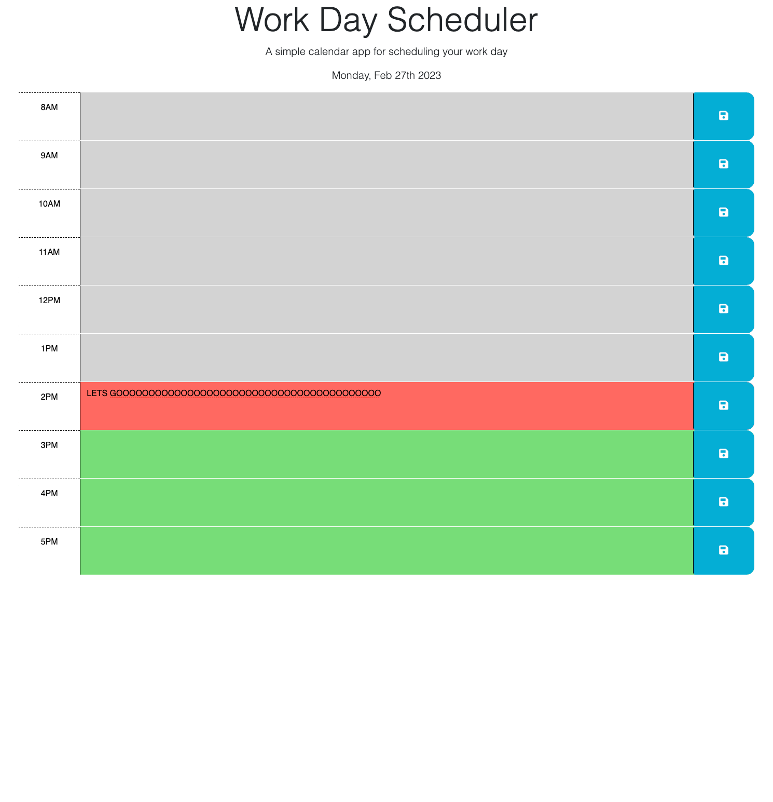

# Challenge_cinco
## Description 
For this week's challenge I have to create a calendar application that allows a user to save events for each hour of the day. The application is consider finsihed once the following criteria is completed

 ## Acceptance Criteria
* GIVEN I am using a daily planner to create a schedule
* WHEN I open the planner
* THEN the current day is displayed at the top of the calendar
* WHEN I scroll down
* THEN I am presented with timeblocks for standard business hours
* WHEN I view the timeblocks for that day
* THEN each timeblock is color coded to indicate whether it is in the past, present, or future
* WHEN I click into a timeblock
* THEN I can enter an event
* WHEN I click the save button for that timeblock
* THEN the text for that event is saved in local storage
* WHEN I refresh the page
* THEN the saved events persist

 ## Work completed
* Displayed current date on the top of the calendar 
* Added more hours to the calendar to help satisfy the needs of typical business hours
* User is able to add events to future time blocks and save them to the local storage 
* Current Hour is displayed as red and future hours displayed as green, hours already past will be in gray
* Added J.queries to html to help the website with displaying the current date on top and controlling what time blocks change color for past, present and future

 ## Website 

 ## Screenshot

 # Contact
 [Nestor Montañez on Github](https://github.com/Nuno0123)
